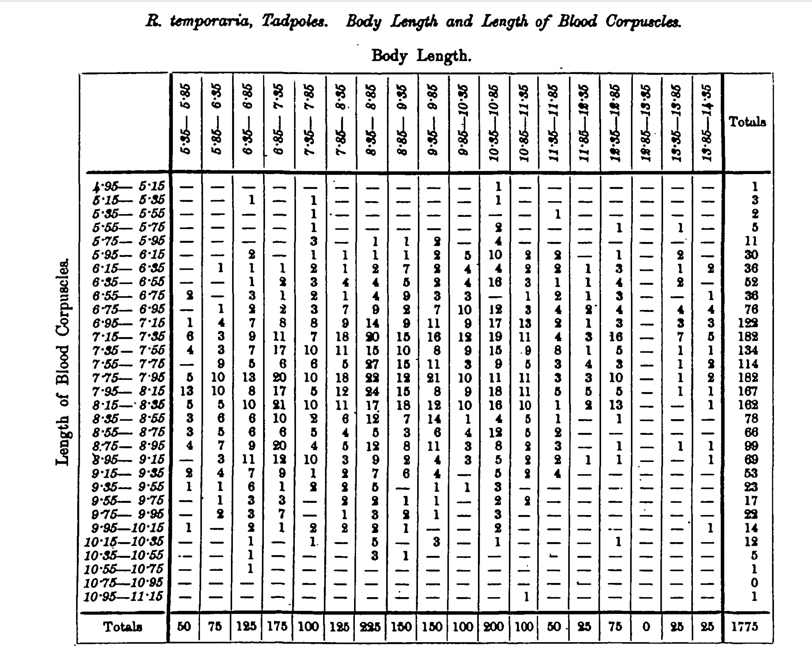
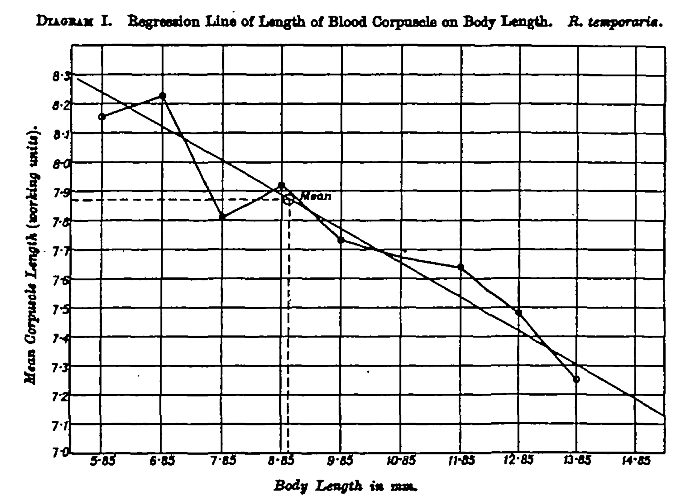

```{r setup, include=FALSE}
knitr::opts_chunk$set(echo = TRUE)
```

***

## Red Blood Cells in the Common Tadpoles.

### A Biometric Study of the red blood corpuscules of the common tadpole (*Rana temporaria*), from the measurements of Ernest Warren, D. Sc. 

 - Author: Karl Pearson, F.R.S.
 - Pearson, K. (1909). A Biometric Study of the Red Blood Corpuscles of the Common Tadpole (Rana Temporaria), from the Measurements of Ernest Warren. Biometrika, 402-419.
 
***

Introduction by Karl Pearson: Extract

  > On leaving for Natal in 1902 to take up his duties at the Government Museum, Pietermaritzburg, Dr WaiTen placed in my bands a quantity of material,
the reductions of which will be published with many other data in a forthcoming memoir on homotyposis. Among this material were measurements on the red blood corpuscles of 71 tadpoles from a pond at Hendon. These measurements were, for several reasons, of peculiar interest to me. I had been working at the blood corpuscles of frogs, and had met with several difficulties in the investigation. One group of these difficulties turned on the problem of the "small sample," and the second set on the doubt which arose in my own mind as to whether the size of the cell in the individual of any species can be considered as independent of the bulk or age of the individual.

The original manuscript can be downloaded from this [link](Data/Red_blood_cells/RED_BLOOD_CORPUSCLES_RANA_1909.pdf)

***

Here we look at the data from Appendix A  




In this table we have the body lenght of the tadpoles and the length of the red Blood Cells. The data is available  [here](DATA/Red_blood_cells/Table_A_lenCorpuscles_Bodylen.xlsx) in an Excel file. To facilitate categorizing the information in the file the first value of the range is used of body length and length of blood corpuscles are shown and not the range of the category as in the table. 

***

Here we present the data in the similar format as the table in the previous figure.


```{r include=FALSE}
library(tidyverse)
library(janitor)
library(reshape) # for the "untable" function
library(gt)
```


```{r echo=FALSE}
library(readxl)
Table_A_lenCorpuscles_Bodylen <- read_excel("DATA/Red_blood_cells/Table_A_lenCorpuscles_Bodylen.xlsx")
gt(head(Table_A_lenCorpuscles_Bodylen, n=3))
#length(Table_A_lenCorpuscles_Bodylen$Num_individuals)
#sum(Table_A_lenCorpuscles_Bodylen$Num_individuals)

BCT=as.data.frame(Table_A_lenCorpuscles_Bodylen) # VERY IMPORTANT STEP, convert to a data frame
#BCT$length_corpuscles=as.character(BCT$length_corpuscles)
#BCT$body_lenght=as.character(BCT$body_lenght)
```

***

## The data was first "untable" 

The function **untable** basically repeats the the selected line the number of times it appears in a specific column.  

As an example line 11 would be repeated 3 times (Num_individuals) in the new data frame


```{r}

head(BCT, n=5)

BCT[10:14,]
```

***

## Untable the data frame

```{r}
BCT2=untable(BCT[,c(1,2)], num =BCT[,3])
head(BCT2)

```

***

## Visualizing data in a modern form

Visualizing the data in a table similar to that published

```{r, out.width="50%"}
BCT2a=BCT2 %>% 
  tabyl(length_corpuscles, body_lenght)
BCT2a
```


```{r}
BCT3<-BCT2a %>% 
  select(1,10:19, 2:9)
BCT3$length_corpuscles = as.factor(BCT3$length_corpuscles)
BCT3
```


```{r out.width="50%"}
gt(BCT3) %>% 
  tab_header(title = md("Body length of tadpoles")) %>% 
   tab_style(
     locations = cells_column_labels(columns = everything()),
     style     = list(
       #Give a thick border below
       cell_borders(sides = "bottom", weight = px(3)),
       #Make text bold
       cell_text(weight = "bold")
     )
   ) %>% 
 tab_style(
    style = cell_borders(sides = "right", color = "black", 
                         style = "dashed", weight = px(3)),
    locations = cells_body(
      columns = c(length_corpuscles)
    )
  ) %>% 
  tab_source_note(source_note = "Pearson, K. (1909). A Biometric Study of the Red Blood Corpuscles of the Common Tadpole (Rana Temporaria), from the Measurements of Ernest Warren. Biometrika, 402-419.") %>% 
  data_color(
    columns = c("5.35", "5.85", "6.35",	"6.85",	"7.35",	"7.85",	"8.35",
                   "8.85",	"9.35",	"9.85",	"10.35",	"10.85",	"11.35",	"11.85",	"12.35",	"13.35",	"13.84",	"13.85"),
    colors = scales::col_numeric(
      palette = c("white", "orange", "brown"),
      domain = c(0, 30))
  )
```

***


## Basic descriptive stats of tadpoles cells of tadpoles

```{r}
#BCT2
## Mean and standar deviation of body length
BCT2 %>% 
  summarize(meanBL=mean(body_lenght),
            SD=sd(body_lenght))

## Mean and standar deviation of length of corpuscules
BCT2 %>% 
    summarize(mean_BC=mean(length_corpuscles),
            SD_BL=sd(length_corpuscles))
```

***

## Regression analisis of tadpole lenght and corpuscule length (mm)


```{r}
ggplot(BCT2, aes(body_lenght, length_corpuscles))+
  geom_count(aes(color=..n..))+
  geom_smooth(method=lm)+
    guides(color = 'legend')+
  guides(size="none")+
  scale_colour_gradient(low = "grey", high = "orange", na.value = NA)
```

***

## Original Figure of regression **Diagram 1** in paper.

Note here that Pearson did not show the whole distribution on the values, which gives an impression of the slope is more negative (although it is the same).  In addition he calculated the mean of corpuscule length for different values of body length.   In addition the 95% CI of the regression line is not present.  



***

# Replicating the figure

We can get a similar type of figure, by limiting the area that is visualized 


```{r}
ggplot(BCT2, aes(body_lenght, length_corpuscles))+
  geom_count(aes(color=..n..))+
  geom_smooth(method=lm)+
    guides(color = 'legend')+
  guides(size="none")+
  scale_colour_gradient(low = "grey", high = "orange", na.value = NA)+
  coord_cartesian(ylim= c(7.0, 8.4), xlim=c(5.85, 14.85))+
  scale_x_continuous(breaks=seq(4.85, 14.85, len=11))+
  xlab("Body length of tadpole")+
  ylab("Length of blood corpuscules")
  
  
```


***

## Regression analisis

Evaluation if the regression model

```{r}
model=lm(length_corpuscles~body_lenght, data=BCT2)
summary(model)
```

***

## Correlation analysis

On page 405 of the paper Pearson calculates the Pearson Correlation coefficient as r= -0.23

The same result is found here.  

```{r}
cor(BCT2$length_corpuscles, BCT2$body_lenght)
```


## Reproduce other figures

